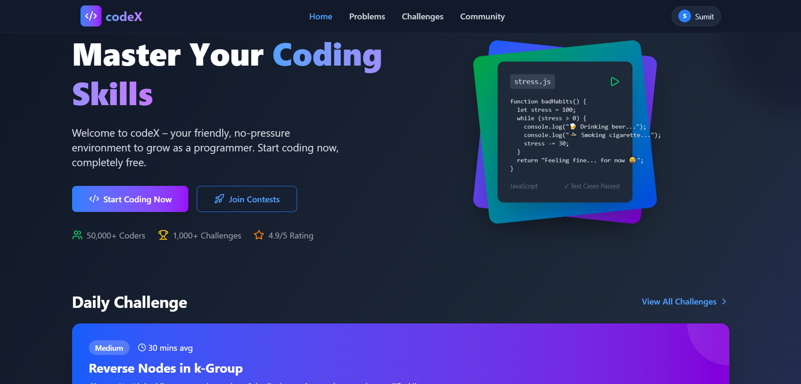
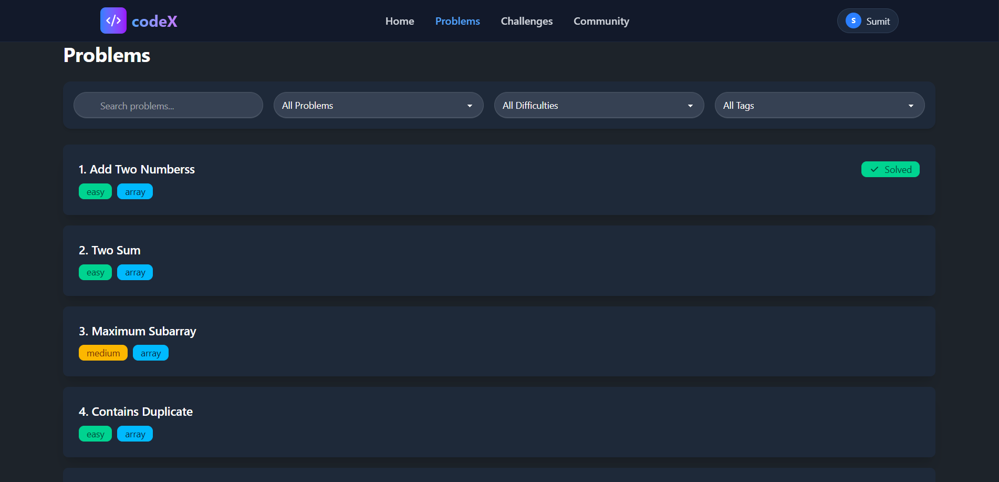
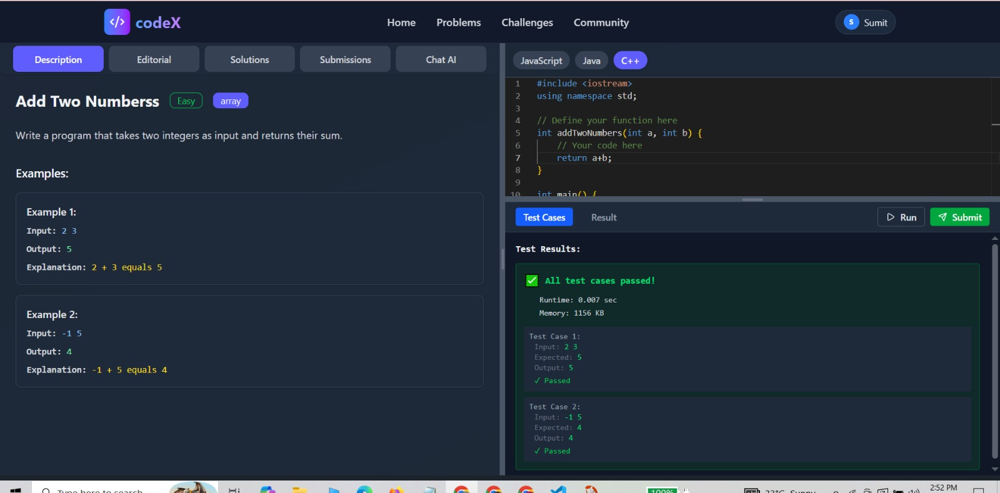
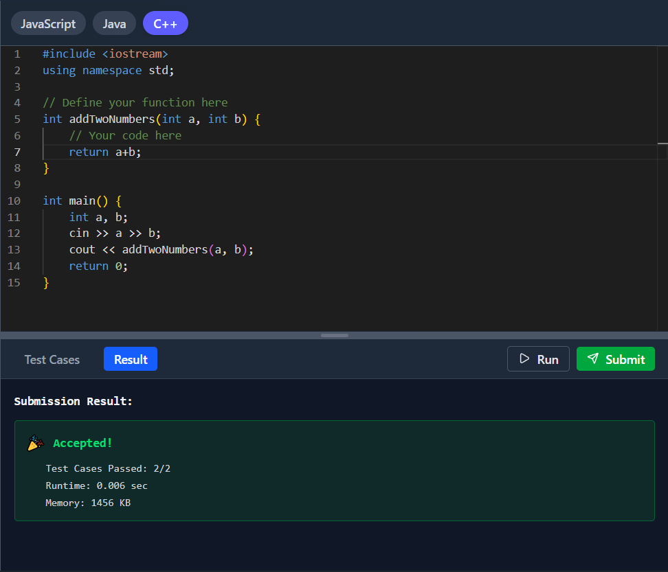
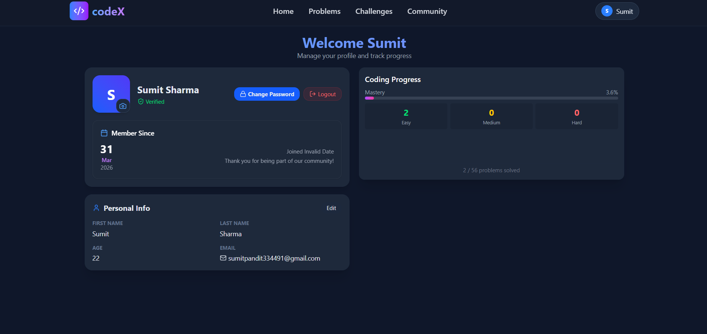

# 💻 codeX

An interactive coding platform where users can solve  problems, write code, and get instant results.

---

## 🚀 Features

* 🔐 User Authentication (Login / Signup)
* 💻 Online Code Editor
* ⚡ Run Code in Multiple Languages
* 📚 Problem Library
* 📊 Submission System
* 🌐 Multi-language Support
* 🧠 AI Integration (Gemini API)
* ☁️ Cloudinary Integration for media handling

---

## 🛠️ Tech Stack

### Frontend

* React.js (Vite)
* Modern UI with reusable components

### Backend

* Node.js
* Express.js

### Database

* MongoDB

### APIs & Tools

* Judge0 API (Code Execution)
* Gemini API (AI Features)
* Cloudinary (Media Storage)
* JWT Authentication

---

## 📁 Project Structure

```
codeX/
│
├── Frontend/                # React / Vite Frontend
│   ├── public/
│   ├── src/
│   │   ├── assets/
│   │   ├── components/
│   │   ├── pages/
│   │   ├── store/
│   │   ├── utils/
│   │   ├── App.jsx
│   │   ├── main.jsx
│   │   └── index.css
│   │
│   ├── .env
│   ├── package.json
│   └── vite.config.js
│
├── backend/                 # Node.js / Express Backend
│   ├── src/
│   │   ├── config/
│   │   ├── controllers/
│   │   ├── models/
│   │   ├── routes/
│   │   ├── middlewares/
│   │   ├── services/
│   │   ├── utils/
│   │   ├── jobs/
│   │   ├── submissions/
│   │   ├── validators/
│   │   └── index.js
│   │
│   ├── .env
│   ├── package.json
│   └── README.md
│
├── .gitignore
└── README.md
```

---

## ⚙️ Environment Variables

### Backend `.env`

```
PORT=
FRONTEND_URL=
DB_CONNECT_STRING=
JWT_KEY=
EMAIL_USER=
EMAIL_PASS=
JUDGE0_KEY=
GEMINI_KEY=
CLOUDINARY_CLOUD_NAME=
CLOUDINARY_API_KEY=
CLOUDINARY_API_SECRET=
```

### Frontend `.env`

```
VITE_BACKEND_URL=
```

---

## ⚙️ Installation & Setup

### 1️⃣ Clone the Repository

```
git clone https://github.com/your-username/codeX.git
cd codeX
```

---

### 2️⃣ Setup Backend

```
cd backend
npm install
node src/index.js
```

---

### 3️⃣ Setup Frontend

```
cd Frontend
npm install
npm run dev
```

---

## 🧪 Usage

1. Register / Login
2. Browse coding problems
3. Write code in the editor
4. Run & submit solutions
5. View results instantly

---

## 📸 Screenshots

*Add screenshots here (Home, Editor, Problems page)*








---

## 🌍 Live Demo

*Add your deployed link here*

---

## 🔒 Security Note

* Never commit `.env` files
* Keep API keys secure
* Use environment variables properly

---

## 🤝 Contributing

Contributions are welcome!

1. Fork the repository
2. Create a feature branch
3. Commit your changes
4. Push and open a Pull Request

---

## 📄 License

This project is licensed under the MIT License.

---

## 👨‍💻 Author

**Sumit Sharma**
GitHub: https://github.com/Sumit1208
